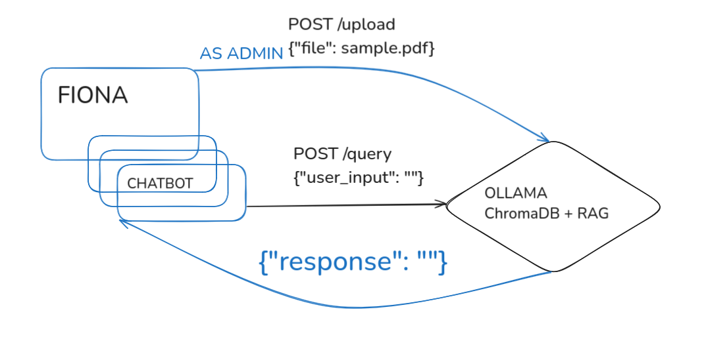

## About the project

This project is a draft of the solution for the https://github.com/mmiv-center/programmer_task

## Built with

* Ollama
* RAG based on ChromaDB
* Python
* PHP
* Bootstrap

## Preventing halucinations

By using vector database, which holds the PDF files and using RAG with LLM

## CI/CD pipeline to react if there are changes in the document

Inside of the docker container running with AI model, we can define an endpoint, where new file could be uploaded and on the backend the script can recreate a new collection for the ChromaDB database.

## Deployment

* Docker container which serves as a standalone web server, with different endpoint (e.g POST /query to generate response, or POST /upload to update collections in the database)

* App code which if compatible with FIONA structure

## Chat UI

With the use of bootstrap, css, html and js we can create a pretty usable and convinient page, which can be used to interact with the user. The user's prompt can be caught from the form and send to a previously set up server.

## Php8 and Apache2

The solution in the github follows the structure of the FIONA app, by configuring the urls it can be accessed as a seprate page.

